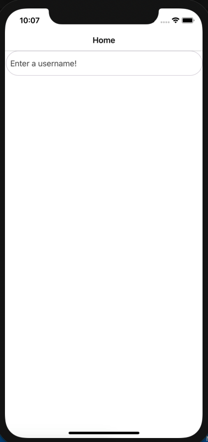
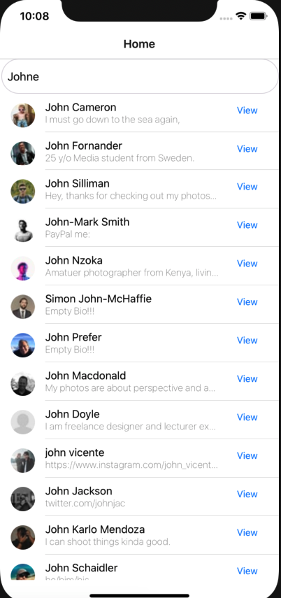
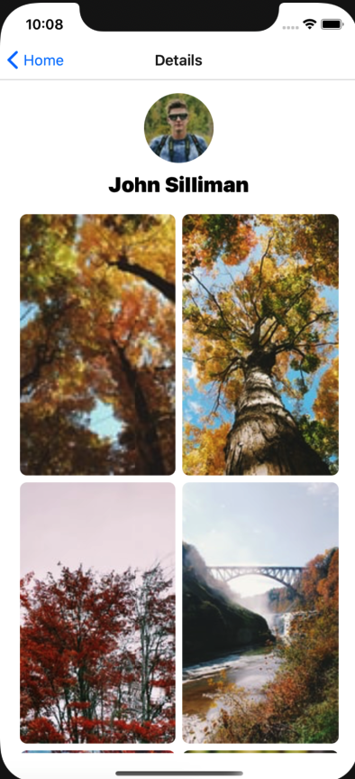
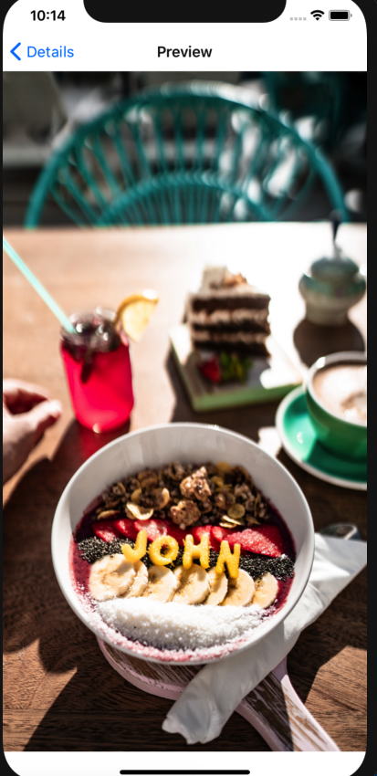

# Unsplash Image Viewer (React Native)

## References

- [API Specifications/Documentation](https://starterspecapi.docs.apiary.io/)
- [Documentation](./docs)
- [Guidelines](https://github.com/emiketic/helloworld-dev/tree/master/docs/guidelines)

## Technology

- [React](https://reactjs.org/) + [Redux](https://redux.js.org/) + [React Native](https://facebook.github.io/react-native/)
- [NativeBase](https://nativebase.io/)
- [React Navigation](https://reactnavigation.org/)

## Requirements

- [Node.js](https://nodejs.org/) + [Yarn](https://yarnpkg.com/)
- [React Native CLI](https://www.npmjs.com/package/react-native-cli) (`npm -g install react-native-cli`)
- Xcode Command Line tools (`xcode-select --install`)

## Usage

```sh
# install dependencies
yarn install

# run bundler
yarn run serve

# run on Android device/emulator
yarn run android

# run on iOS device/simulator
yarn run ios

# run tests
yarn run test

# lint code
yarn run lint

# format code
yarn run format
```

## Debugging

From DevTools

```javascript
// use logger
Logger.debug('Hello World!');

// check if there is an authenticated session
AuthService.isAuthenticated();

// get state from Redux store
$store.getState().MyModule.myField;

// dispatch action from Redux store
$store.dispatch($state.MyModule.$myAction(/* args */));
```

## Screens

### Search Screen


### User list


### user detail


### full screen image viewer



